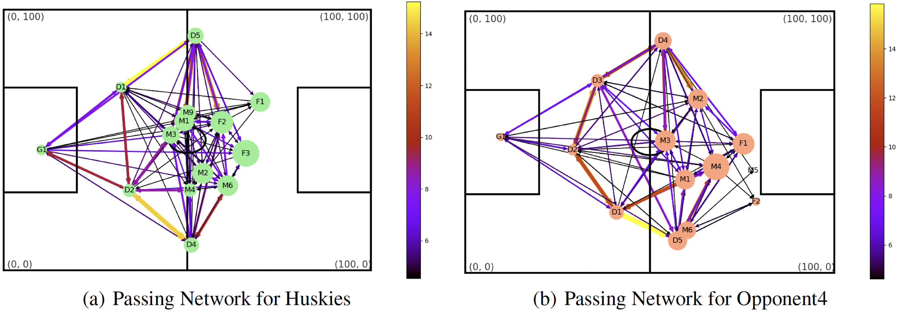

# Uncovering Successful Teamwork in Soccer Matches Through Network Science

## Data Files
All data have been uploaded to [`data`](./data) directory.
1. matches.csv
2. passingevents.csv
3. fullevents.csv

## Environment Settings
```shell
pip install -r requirement.txt
```

Then please change directory to `code` by
```shell
cd code
```

## Build the Passing Network Graph
```shell
python draw_passing_net.py --match_id <match_id> <--guest>
```
The result will be saved in `result/fig/` directory with the name `"network_${Match_id}_${host/guest}.jpg"`



## Create Adjacent Matrix
```shell
python create_adj_matrix.py
```
The generated matrices are saved in `result/adj/` directory with the name `adj_matrix${Match_id}.csv`. And `player_index_map.txt` save the mapping information from player names to their corresponding indices used in the adjacent matrices.

## Micro-scale Features
Including **Clossness Centrality, Betweeness Centrality, Local Clustering Coefficient and Eigenvector Centrality**.
```shell
python get_micro_fea.py --match_id <match_id> --team <'Huskies' or 'Opponent'> --time_span <timespan>
```
Results will be saved in `./result` directory with the name `"match_${Match_id}_${Huskies/Opponent}_info.csv"`. And detailed infos are saved in `csv` file as
```text
player, closeness, betweenness, clustering, eigenvector
```

## Meso-scale Features
**Flow Motif**
```shell
python motif.py --type unnamed
# The output 5 numbers of each term are the count of (ABAB, ABAC, ABCA, ABCA, ABCB, ABCD) respectively.
```
The result will be saved in `result/motif_3pass.csv`.

**Passing Network Motif**
```shell
python motif.py --type named
```

## Macro-scale Features
**Centroid**
```shell
python centroid.py --time_span <timespan>
```
The result will be saved in `result/centroid.csv`

We also write a program to visualize the change of centroid around the whole match.
```shell
python draw_centroid.py --match_id <match_id> --time_span <timespan>
```
The result will be saved in `result/fig/` directory with the name `"centroid_${Match_id}.jpg"`


**The Distribution of Microscale Features**
```shell
python get_macro_fea.py --indicator <indicator type>
```
The indicator type should be in `[betweenness, closeness, top_5_closeness, low_5_closeness, personal_closeness, clustering, personal_clustering, eigen_mean, eigen_var, alg_connectivity]`.

## Other Indicators
**The Indicator of Homogeneous Markov Chain.**
```shell
python markov.py
```
The result will be saved in `result/vari_stable.csv`. The first column is about the variance for the whole match, while the second column is the variance for the first half.

## Appendix
Copyright: Zhixuan Liang
